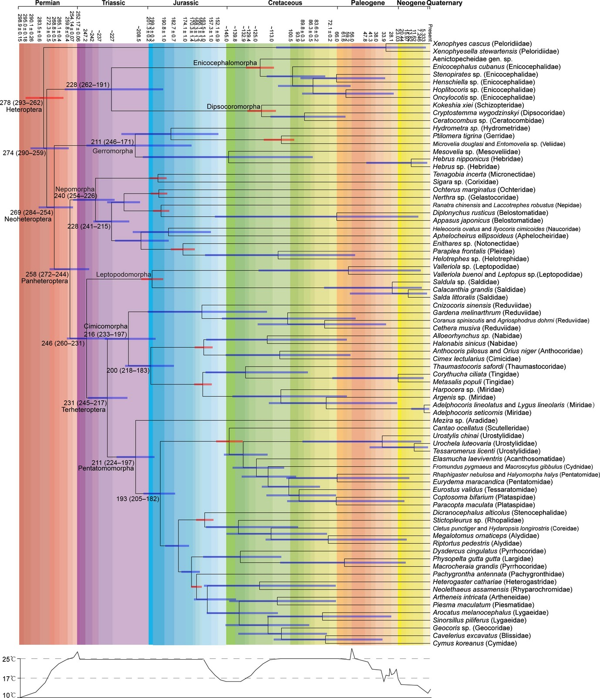
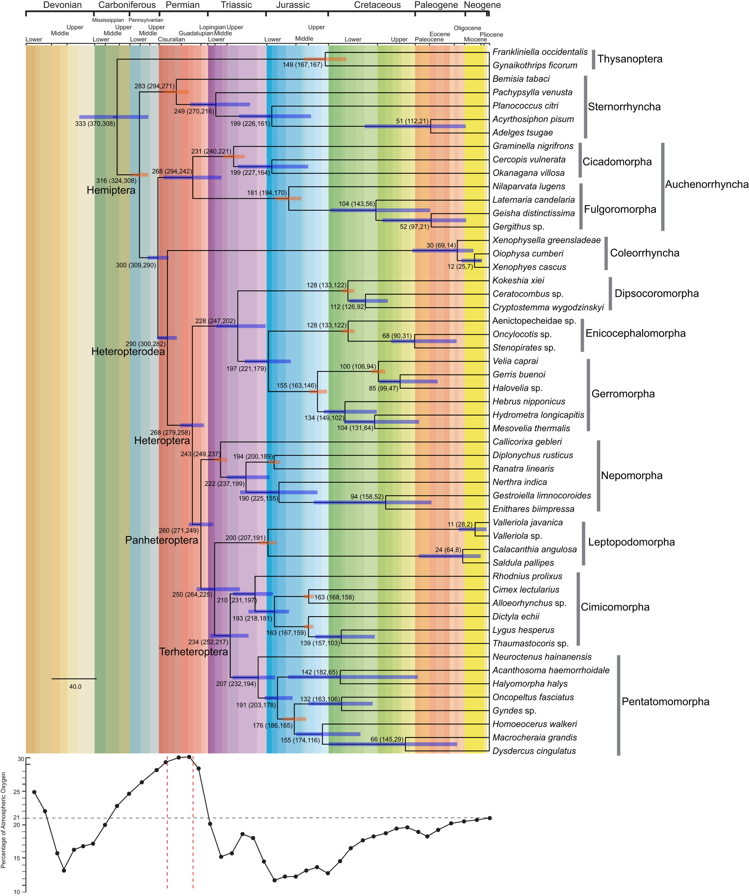

```{r knitr-setup, include=FALSE}
knitr::opts_chunk$set(fig.path = "ggcsgb/", fig.retina = 2)
knitr::opts_chunk$set(message = FALSE)
```

```{r echo=FALSE, results="asis", include=knitr::opts_knit$get("rmarkdown.pandoc.to") == "markdown_github"}
# github_document doesn't support toc, md_documet discard yaml metadata, so I can only do it myself
cat("<h1 align='center'>", rmarkdown::metadata$title,"</h1>\n")
cat("<p align='center'>\n", rmarkdown::metadata$author,"</p>\n")
cat("<p align='center'>\n", rmarkdown::metadata$date,"</p>\n")
cat("---------------\n")
```


# preparation

install needed R packages

```{r install-pkg, eval=FALSE}
remotes::install_github(c("dongzhuoer/ggcsgb"), upgrade = TRUE)
```
```{r install-pkg, include=FALSE, eval=Sys.getenv("CONTINUOUS_INTEGRATION") == "true"}
```

```{r setup, message=FALSE, warning=FALSE}
library(magrittr)
```

Set global theme for ggplot

```{r theme}
ggplot2::theme_set(
    ggplot2::theme(
        axis.line.y = ggplot2::element_blank(),
		axis.ticks.y = ggplot2::element_blank(),
        axis.text.y = ggplot2::element_blank(),
        axis.line.x = ggplot2::element_line()
    ) + ggplot2::theme_grey()
)
```


# Cladistics 2015



```{r 2015rep, fig.dim=c(12, 10)}
"ggcsgb/2015.tree" %>% treeio::read.beast() %>% ggtree::ggtree() +
    ggtree::geom_tiplab(size = 3) + ggplot2::geom_blank(ggplot2::aes(x = 370)) + 
    ggcsgb::chrono_strati_arg() + 
	ggcsgb::chrono_strati_bar() + 
	ggcsgb::chrono_strati_axis() + 
	ggcsgb::chrono_strati_label()
```


# Scientific Reports 2016


```{r 2016rep, fig.dim=c(12, 8)}
"ggcsgb/2016.tree" %>% treeio::read.beast() %>% ggtree::ggtree() +
    ggtree::geom_tiplab(size = 3) + ggplot2::geom_blank(ggplot2::aes(x = 570)) + 
    ggcsgb::chrono_strati_arg() + 
	ggcsgb::chrono_strati_bar() + 
	ggcsgb::chrono_strati_axis() + 
	ggcsgb::chrono_strati_label()
```


# Cladistics 2017



```{r 2017rep, fig.dim=c(12, 8)}
"ggcsgb/2017.tree" %>% treeio::read.beast() %>% ggtree::ggtree() +
    ggtree::geom_tiplab(size = 3) + ggplot2::geom_blank(ggplot2::aes(x = 390)) + 
    ggcsgb::chrono_strati_arg(offset_first = 1) + 
	ggcsgb::chrono_strati_bar() + 
	ggcsgb::chrono_strati_axis() + 
	ggcsgb::chrono_strati_label()
```
