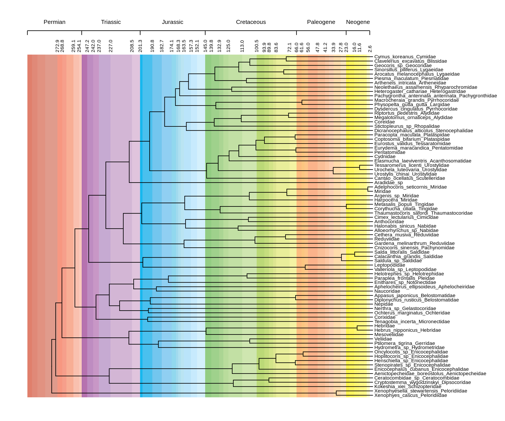
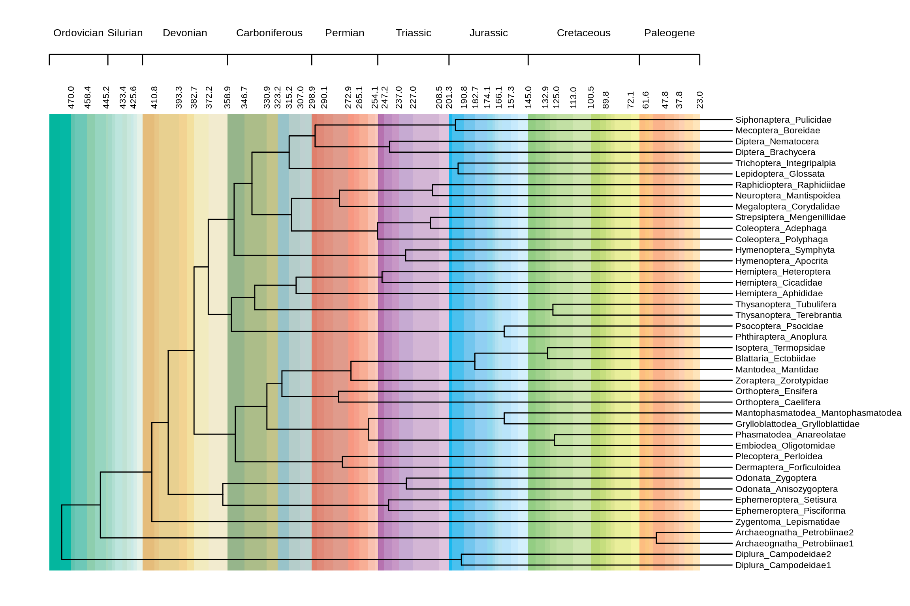
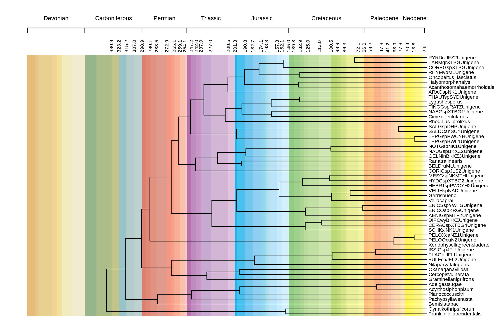

-   [preparation](#preparation)
-   [Cladistics 2015](#cladistics-2015)
-   [Scientific Reports 2016](#scientific-reports-2016)
-   [Cladistics 2017](#cladistics-2017)

<h1 align="center">
Reproduce Chronostratigraphic Background in Three Papers by Prof. Xie
</h1>
<p align="center">
Zhuoer Dong
</p>
<p align="center">
2018-12-13 (rendered on `r Sys.Date()`)
</p>

------------------------------------------------------------------------

preparation
===========

install needed R packages

``` r
remotes::install_github(c("dongzhuoer/ggcsgb"), upgrade = TRUE)
```

``` r
library(magrittr)
```

Set global theme for ggplot

``` r
ggplot2::theme_set(
    ggplot2::theme(
        axis.line.y = ggplot2::element_blank(),
        axis.ticks.y = ggplot2::element_blank(),
        axis.text.y = ggplot2::element_blank(),
        axis.line.x = ggplot2::element_line()
    ) + ggplot2::theme_grey()
)
```

Cladistics 2015
===============


``` r
"ggcsgb/2015.tree" %>% treeio::read.beast() %>% ggtree::ggtree() +
    ggtree::geom_tiplab(size = 3) + ggplot2::geom_blank(ggplot2::aes(x = 370)) + 
    ggcsgb::chrono_strati_arg() + 
    ggcsgb::chrono_strati_bar() + 
    ggcsgb::chrono_strati_axis() + 
    ggcsgb::chrono_strati_label()
```



Scientific Reports 2016
=======================


``` r
"ggcsgb/2016.tree" %>% treeio::read.beast() %>% ggtree::ggtree() +
    ggtree::geom_tiplab(size = 3) + ggplot2::geom_blank(ggplot2::aes(x = 570)) + 
    ggcsgb::chrono_strati_arg() + 
    ggcsgb::chrono_strati_bar() + 
    ggcsgb::chrono_strati_axis() + 
    ggcsgb::chrono_strati_label()
```



Cladistics 2017
===============


``` r
"ggcsgb/2017.tree" %>% treeio::read.beast() %>% ggtree::ggtree() +
    ggtree::geom_tiplab(size = 3) + ggplot2::geom_blank(ggplot2::aes(x = 390)) + 
    ggcsgb::chrono_strati_arg(offset_first = 1) + 
    ggcsgb::chrono_strati_bar() + 
    ggcsgb::chrono_strati_axis() + 
    ggcsgb::chrono_strati_label()
```


