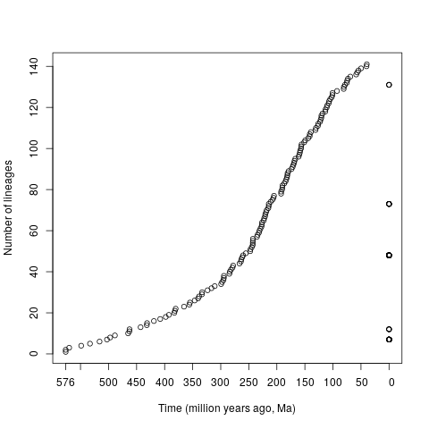
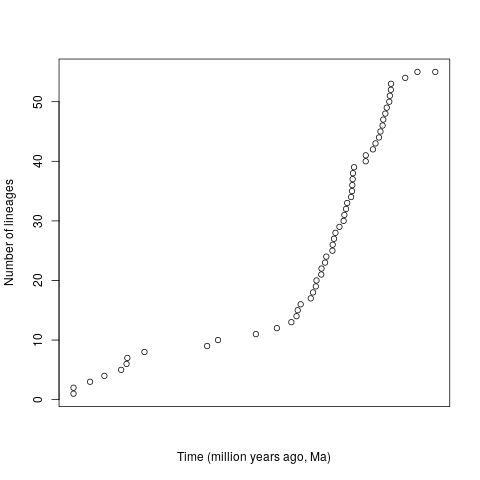
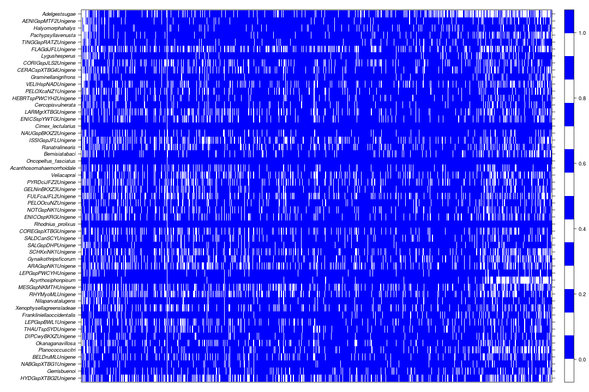

# Overview

auxiliary work at [Qiang Xie](http://lifesciences.sysu.edu.cn/teachers/professor/282)'s Lab


# some links

- [papers](https://www.scopus.com/authid/detail.uri?authorId=35097973900)
- **[phylobat](https://gitlab.com/dongzhuoer/phylobat)** package
- https://gitlab.com/dongzhuoer/BAMM-demo


# ltt

- 王艳会

```r
tree1 <- ape::read.nexus('data-raw/xie/uniform_calibrations_plusDictyoptera.tree')
ltt1 <- phytools::ltt(tree1, log.lineages = F)

plot(
    ltt1$times, ltt1$ltt, type = 'p', xaxt = 'n',
    xlab = 'Time (million years ago, Ma)', ylab = 'Number of lineages'
)
x.axis = c(0, seq(0.2638, 6, 0.5))
x.labels = format(576.38 - x.axis*100, digits = 2)
axis(1, x.axis, x.labels)
```


- 吴燕卓

```r
tree2 <- ape::read.nexus('data-raw/xie/burnin75.tree')
ltt2 <- phytools::ltt(tree2, log.lineages = F)

plot(
    ltt2$times, ltt2$ltt, type = 'p', xaxt = 'n',
    xlab = 'Time (million years ago, Ma)', ylab = 'Number of lineages'
)
```



# filter short sequence

当时帮王艳会师姐写了个 `.Rmd`，用来去除 FASTA 文件中的短序列。后来 **bioinfor** 改名为 **biozhuoer**， `read_fasta()` 的用法也略有差别。

```r
# 按Ctrl+Enter可以执行光标所在行, 顺次按指示执行即可处理完一个文件

# 在此输入名字
name <- 'SRR4113498'

fasta <- bioinfor::read_fasta(paste0('data-raw/', name, '.fasta'))
seq.len <- stringr::str_length(fasta)
hist(seq.len, breaks = 200)


# 在此输入最小长度，然后执行下一句话，知道找到满意值为止
min <- 200
hist(seq.len[seq.len >= min], breaks = 200)

# 上面调好后执行这一句
result <- fasta[seq.len >= min];
bioinfor::write_fasta(result, paste0('data-raw/', name, '-trim.fasta'));
```


# gene coverage

```r
# NOT run, since phylobat.data doesn't contains `3102fa/` any longer
library(stringr)

file <- dir(system.file('extdata/3102fa', package = 'phylobat.data'), full.names = T)
gene <- vector('list', length(file))
species <- character(0)

for (i in seq_along(file)) {
    fa <- readr::read_lines(file[i])
    gene[[i]] <- str_replace(na.omit(str_extract(fa, '>\\w*')), '>', '')
    species = union(species, gene[[i]])
}
names(gene) <- str_replace(str_match(file, '\\w*.fa$'), '.fa', '')

mat <- matrix(0, length(species), length(gene))
dimnames(mat) <- list(species, names(gene))
for (i in seq_along(gene))
    mat[,i] = as.integer(species %in% gene[[i]])
write.csv(mat, 'mat.csv')
```

```r
mat <- read.csv('data-raw/xie/mat.csv', row.names = 1)

lattice::levelplot(
    t(mat), col.regions=c('white','blue'), aspect = 'fill',
    scales = list(x = list(draw = F), y = list(fontface = 'italic')), 
    xlab = NULL, ylab = NULL
)
```



# Partition Finder to RAxML

```r
#' @title transform linux raxml txt to Windows raxml bat
raxml_bat <- function(txt) {
    txt %<>% stringr::str_remove('\\d+-\\d+\\|') %>% 
        stringr::str_remove('\\|\\.[\\w\\W]*$') %>% 
        stringr::str_remove('^\\d+\\|')
    txt1 <- txt %>% stringr::str_extract('^\\w+\\|') %>% stringr::str_remove('\\|')
    txt2 <- txt %>% stringr::str_extract('\\|\\w+$') %>% stringr::str_remove('\\|')

    p <- as.integer(runif(length(txt),10263,99865))
    x <- as.integer(runif(length(txt),5,99489))

    stringr::str_c(
        'raxmlHPC-PTHREADS-AVX -m PROTGAMMA', txt1, ' -T 3 -f a -n ', txt2, 
        ' -s ', txt2, '.fa -# 150 -p ', p, ' -x ', x
    ) %>% c('exit')
}
```

```r
txt.raw <- readr::read_lines('data-raw/xie/start_scheme.txt', skip = 8) %>%
    stringr::str_subset('^\\d') %>% stringr::str_remove(fixed('+G')) %>% 
    stringr::str_replace(fixed('+F'), 'F') %>% stringr::str_remove_all(' ')

# In original code, there is a bug. I use `na.omit()` after str_extract(), 
#   which cause different length between txt.raw and model, thus result is wrong
model <- txt.raw %>% 
    stringr::str_extract('\\|\\w*?\\+I') %>% stringr::str_remove('\\|') %>% 
    stringr::str_remove('\\+I') %>% stringr::str_c('|I', .)

txt.raw %>% str_replace( '\\|\\w*?\\+I', model) %>% 
    raxml_bat() %>% readr::write_lines('start_scheme_3045genes.bat')
```


# 投稿稿件自查的经验

1. 照猫画虎，从要投稿的目标期刊下载近期文章2-3篇，根据相应格式写作
2. 对照期刊的投稿指南，逐条修改。
3. 自查的时候，每次给自己一个比较单一的检查任务，比如第一遍查英文拼写，第二遍查学名斜体，第三遍查引用和参考文献的对应，第四遍查图表引用的序号顺序，第五遍查参考文献格式，第六遍查各段落是否自己一个主要表达的意思、长短是否合适、有没有总分总或总分的架构，各段落之间的前后顺序是否合适、首末句的承上启下是否恰当，第七遍专门查图表......

具体各项检查的顺序因人而异，但是这些方面都在自查之列

还有，缩写有没有提前定义过
还有，凡是与学术相关的词汇，不要追求变换表达方式，尤其是名词，以便读者更能读懂前后对应关系

多个学术词汇同时出现的时候，如果出现不止一次，那么最好先确定一个比较恰当的相对顺序，然后全文保持一致。比如一个属的几个物种，或者几种同时使用的分析方法

每个初学者在检查自己稿件的时候，都难免限于第一人称视角、看不出自己写作的问题，通过多次单一任务的检查可以较为有效地跳出这种局限，慢慢学会站在旁观者的角度看自己的工作


# 100 paper for ecologist 节选

- 2016Species Concepts in Biology_ Historical Development, Theoretical Foundations and Practical Relevance
- Chave2013The problem of pattern and scale in ecology, what have welearned in 20 years
- Courchamp2017articles every ecologist should read
- Ginzburg2004Rules of thumb for judging ecological theories
- Leibold2004The metacommunity concept, a framework for multi-scale community ecology
- Parmesan2003A globally coherent fingerprint of climate change impacts across natural systems
- Tilman2014Biodiversity and Ecosystem Functioning