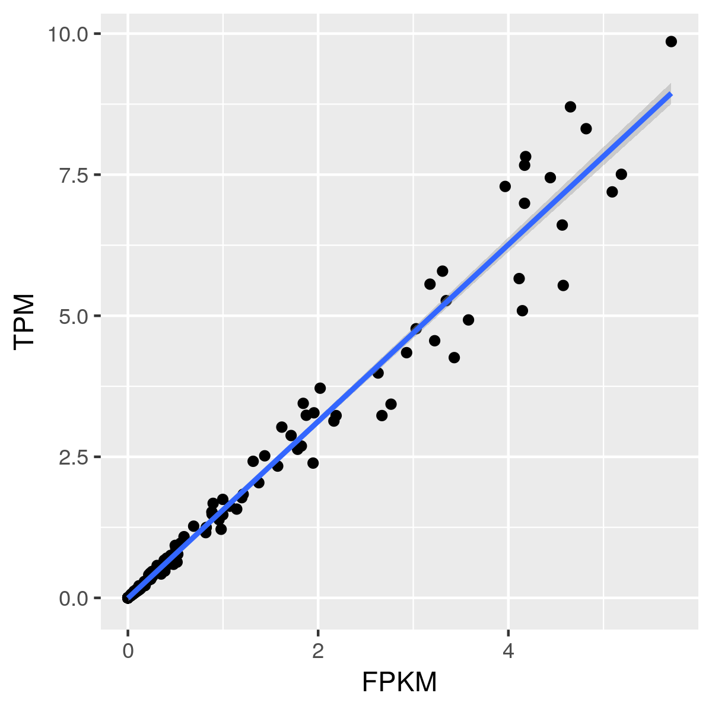
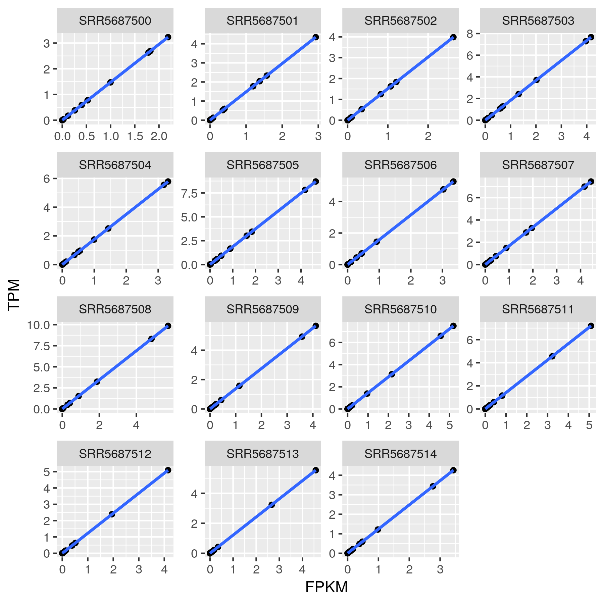
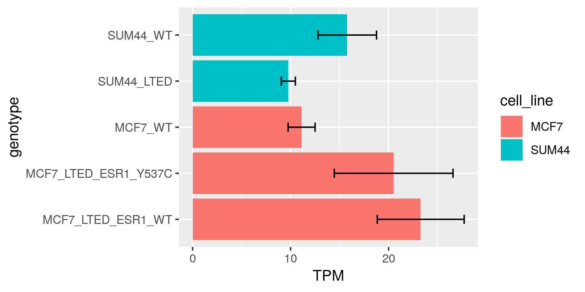

```r
library(tidyverse)
```


# Lem4 expression in PRJNA390636 (GSE100075)


## download raw data

```r
read_tsv('data-raw/PRJNA390636.txt') %>% 
    .$fastq_ftp %>% str_split(';') %>% unlist %>% 
    paste0('ftp://', .) %T>% print %>% write_lines('sra.md')
#>  [1] "ftp://ftp.sra.ebi.ac.uk/vol1/fastq/SRR568/000/SRR5687500/SRR5687500_1.fastq.gz"
#>  [2] "ftp://ftp.sra.ebi.ac.uk/vol1/fastq/SRR568/000/SRR5687500/SRR5687500_2.fastq.gz"
#> ...
#> [30] "ftp://ftp.sra.ebi.ac.uk/vol1/fastq/SRR568/004/SRR5687514/SRR5687514_2.fastq.gz"
```

then download `.fastq.gz` in `sra.md` into `GSE100075/fastq/`.

```r
# check that the following R code includes all input files 
identical(
    dir('GSE100075/fastq/') %>% stringr::str_remove('_\\d.fastq.gz') %>% unique,
    formatC(0:14, width = 2, flag = '0') %>% paste0('SRR56875', .)
)
```

- download ftp://ftp.ccb.jhu.edu/pub/infphilo/hisat2/data/grch38.tar.gz
- ftp://ftp.ensembl.org/pub/release-92/gtf/homo_sapiens/Homo_sapiens.GRCh38.84.gtf


## assembly RNA-seq

although all support specifying threads number, only hisat can _really_ run in parallel

```r
# intermediate .sam file is quite large, hisat is IO intensive while samtools runs quickly
hisat_command <- 'hisat2 -p 24 --dta -x GSE100075/grch38/genome -1 GSE100075/fastq/SRR5687500_1.fastq.gz -2 GSE100075/fastq/SRR5687500_2.fastq.gz -S GSE100075/assembly/SRR5687500.sam; samtools sort -@ 24 -o GSE100075/assembly/SRR5687500.bam GSE100075/assembly/SRR5687500.sam; rm GSE100075/assembly/SRR5687500.sam'
formatC(0:14, width = 2, flag = '0') %>% paste0('SRR56875', .) %>% sapply(. %>% stringr::str_replace_all(hisat_command, 'SRR5687500', .))      %>% paste0(collapse = '; ')   %>% paste0('nohup bash -c "', ., '" &> /dev/null &') %>% write_lines('temp.sh')

# we use mclapply for paralleling, but IO limits CPU use efficientcy
stringtie_command <- 'stringtie -p 2 -G GSE100075/Homo_sapiens.GRCh38.84.gtf -o GSE100075/assembly/SRR5687500.gtf -l SRR5687500 GSE100075/assembly/SRR5687500.bam'
formatC(0:14, width = 2, flag = '0') %>% paste0('SRR56875', .) %>% sapply(. %>% stringr::str_replace_all(stringtie_command, 'SRR5687500', .))  %>% paste0('\'', ., '\'', collapse = ', ') %>% paste0('nohup R -e "parallel::mclapply(c(', ., '), system, mc.preschedule = F)" &> /dev/null &') %>% write_lines('temp.sh')
```

```bash
ls GSE100075/assembly/SRR*.gtf > GSE100075/assembly/mergelist.txt

stringtie --merge -p 24 -G GSE100075/Homo_sapiens.GRCh38.84.gtf -o GSE100075/assembly/merged.gtf GSE100075/assembly/mergelist.txt
```


## calculate expression

```r
# we don't use parallel duo to IO bottleneck
stringtie_command2 <- 'stringtie -e -B -p 24 -G GSE100075/assembly/merged.gtf -o GSE100075/assembly/SRR5687500-ballgown.gtf -l SRR5687500 GSE100075/assembly/SRR5687500.bam'
formatC(0:14, width = 2, flag = '0') %>% paste0('SRR56875', .) %>% sapply(. %>% stringr::str_replace_all(stringtie_command2, 'SRR5687500', .)) %>% paste0(collapse = '; ')   %>% paste0('nohup bash -c "', ., '" &> /dev/null &') %>% write_lines('temp.sh')
```

```bash
for id in `ls *ballgown* | sed 's/-ballgown.gtf//'`; do cat "$HOME/GSE100075/assembly/$id-ballgown.gtf" | grep -P 'ANKLE2'  | grep -P 'transcript\t' | sed -r "s/StringTie/$id/"; done > GSE100075/GSE100075-ANKLE2.gtf
```


## plot in R

`GSE100075-biosample_result.xml` comes from https://www.ncbi.nlm.nih.gov/biosample?Db=biosample&DbFrom=bioproject&Cmd=Link&LinkName=bioproject_biosample&LinkReadableName=BioSample&ordinalpos=1&IdsFromResult=390636

```r
sample_table <- inner_join(
	x <- read_tsv('data-raw/PRJNA390636.txt') %>% select(sample_accession, run_accession),
	y <- xml2::read_xml('data-raw/GSE100075-biosample_result.xml') %>% 
        xml2::as_list() %>% {.[[1]]} %>% 
        sapply(. %>% {c(id = .$Ids$Id[[1]], description = .$Description$Title[[1]])}) %>% 
		t %>% as_tibble(),
	by = c('sample_accession' = 'id')
) %>% select(sample = run_accession, description) %T>% print;
#> # A tibble: 15 x 2
#>    sample     description               
#>    <chr>      <chr>                     
#>  1 SRR5687500 MCF7_WT_repl1             
#> ...       
#> 15 SRR5687514 SUM44_LTED_repl3   

df <- read_lines('data-raw/GSE100075-ANKLE2.gtf') %>% {tibble(
		sample = str_extract(., 'SRR\\d+'), 
		transcript = str_extract(., 'transcript_id "\\.\\w+'), 
		FPKM = str_extract(., '(?<=FPKM ")[\\.\\d]+') %>% as.numeric, 
		TPM = str_extract(., '(?<=TPM ")[\\.\\d]+') %>% as.numeric
)} %>% inner_join(sample_table) %T>% print;
#> # A tibble: 180 x 5
#>    sample     transcript     FPKM      TPM description  
#>    <chr>      <chr>         <dbl>    <dbl> <chr>        
#>  1 SRR5687500 NA         0        0        MCF7_WT_repl1
#>  2 SRR5687500 NA         0.998    1.47     MCF7_WT_repl1
#>  ...
```

```r
# 总体来看，FPKM 与 TPM 有很强的线性关系
ggplot(df, aes(FPKM, TPM)) + geom_point() + geom_smooth(method = "lm")
```


```r
# In every sample, FPKM 与 TPM 完美线性相关
ggplot(df, aes(FPKM, TPM)) + geom_point() + geom_smooth(method = "lm") + facet_wrap(~sample, scales = 'free')
ggsave('FPKM-TPM-per-sample-GSE100075.png', width = 6, height = 6)
```


```r
df %>% group_by(sample) %>% 
    dplyr::summarise(TPM = sum(TPM), description = description[1]) %>%
	mutate(genotype = str_remove(description, '_repl\\d')) %>% 
    group_by(genotype) %>% summarise(TPM_mean = mean(TPM), TPM_std = sd(TPM)) %>%
	mutate(cell_line = str_extract(genotype, '\\w+?(?=_)'))  %T>% print %>%
	ggplot(aes(genotype, TPM_mean, fill = cell_line)) + 
        geom_bar(position=position_dodge(), stat = "identity") +
        geom_errorbar(aes(ymin = TPM_mean - TPM_std, ymax = TPM_mean + TPM_std), width = .2, position = position_dodge(.9)) + 
        labs(y = 'TPM') +
        coord_flip()
        theme(axis.text.x = element_text(angle = 60))
#> # A tibble: 5 x 4
#>   genotype             TPM_mean TPM_std cell_line
#>   <chr>                   <dbl>   <dbl> <chr>    
#> 1 MCF7_LTED_ESR1_WT       23.3    4.44  MCF7     
#> ... 
#> 5 SUM44_WT                15.8    2.99  SUM44    
```



# 04/19 co-expression between Lem4 and mki67

```r 
lem4_mki67s <- mclapply(
    c('GSE2990', 'GSE2034', 'GSE16446', 'GSE20685', 'GSE17705', 'GSE11121'),
    . %>% {
        chip <- qGSEA::read_chip(paste0('MKI67/', ., '.chip'))
        matrix <- qGSEA::read_txt(paste0('MKI67/', ., '.txt'))
        lem4_mki67 <- qGSEA::make_phenotype(matrix, chip, c('ANKLE2', 'MKI67')) 
        add_column(lem4_mki67, accession = .)
    }
) %>% bind_rows()
```

```r
ggplot(lem4_mki67s, aes(log10(ANKLE2), log10(MKI67))) + 
    geom_point() + geom_smooth(method = 'lm') + 
    facet_wrap(~accession, scales = "free") +
    ggpmisc::stat_poly_eq(
        formula = y ~ x, 
        aes(label = paste(..rr.label.., sep = "~~~")), 
        parse = TRUE
    ) 
```

```r
ggplot(filter(lem4_mki67s, accession == 'GSE2990'), aes(log10(ANKLE2), log10(MKI67))) + 
    geom_point() + geom_smooth(method = 'lm', se = F, color = 'black')  +
    ggpmisc::stat_poly_eq(
        formula = y ~ x, 
        aes(label = paste0('atop(', ..eq.label.., ' ,', ..rr.label.., ')'), size = 20), 
        parse = TRUE
    ) + cowplot::theme_cowplot(12) + 
    labs(x = 'ANKLE2 (Log10)', y = 'MKI67 (Log10)')
```

